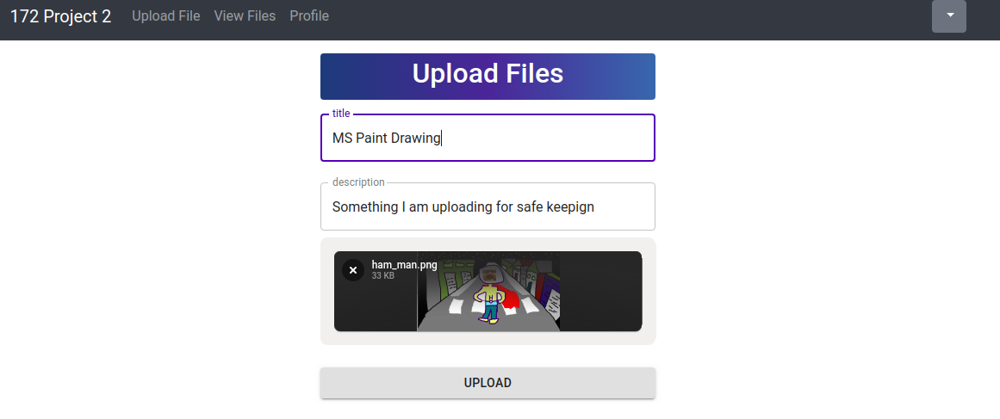

[](https://circleci.com/gh/evanugarte/SmartPhotoCategorizer)

# SmartPhotoCategorizer
[Using Amazon Rekognition](https://aws.amazon.com/rekognition/), this
application categorizes photos uploaded by users and allows photos to be
shared between account.

## Class/Contributor Info
- **University**: San Jose State University
- **Course**: [CMPE 172: Enterprise
Software](http://info.sjsu.edu/web-dbgen/catalog/courses/CMPE172.html)

**Professor**: [Sanjay Garje](https://www.linkedin.com/in/sanjaygarje/)

**Students**: [Minh Phan](https://github.com/minhphan156),
[Evan Ugarte](https://github.com/evanugarte),
[Yanyan Yang](https://github.com/goldfishyyy),
[Roy Zhang](https://github.com/Hanasou)

**Project Introduction**:
- Upload, Delete and Search for Photos
- Uses AWS Rekognition to automatically categorize photos when they are uploaded
- Users can retrieve photos based on autogenerated tags

## Sample Demo Screenshots
### Custom Sign in


### Social Page Photo


### Social Page Shared Photo


### Upload Image


### Viewing All Tags


### Finding Uploaded Image by Tag


## Getting Started

These instructions will get you a copy of the project up and running on your local machine for development and testing purposes.

### Pre-Requisites Setup
You need **Node.js** and **Redux DevTools** prior to installing.
* Install Node.js
    * Install the latest [Node version](https://nodejs.org/en/download/) from
    the Node.js website for your proper OS.
* Install Redux Devtools
    * Install the latest [Redux DevTools](https://chrome.google.com/webstore/detail/redux-devtools/lmhkpmbekcpmknklioeibfkpmmfibljd?hl=en) from the Google Chrome extension store.

### Running the Project Locally
With Node and Redux DevTools installed, clone this repository with
```
git clone https://github.com/evanugarte/SmartPhotoCategorizer.git
```

* In Command Prompt:
    1. Go to file location in your machine: `cd SmartPhotoCategorizer`
    2. Install all dependencies with 
    ```
    npm install && cd back-end && npm install
    ```
    3. To run the program:
    * To first start the backend, enter the `back-end` folder and start the
    server with
    ```
    cd back-end && npm start
    ```
    * Then, in the `SmartPhotoCategorizer` folder, run
    ```
      npm run start
    ```
    * The application should open in the browser shortly after.

### Cloud Services
- S3 buckets to hold images and stage website
- DynamoDB tables to store user information and references to photo objects
- Route53 for domain name and routing
- ELB, ASG, and EC2 to host our server and direct traffic
- CloudFront for content delivery
- SNS and CloudWatch for notifications about our system
- Rekognition for label detection on images
- Cognito user pool for user authentication
- test edit
